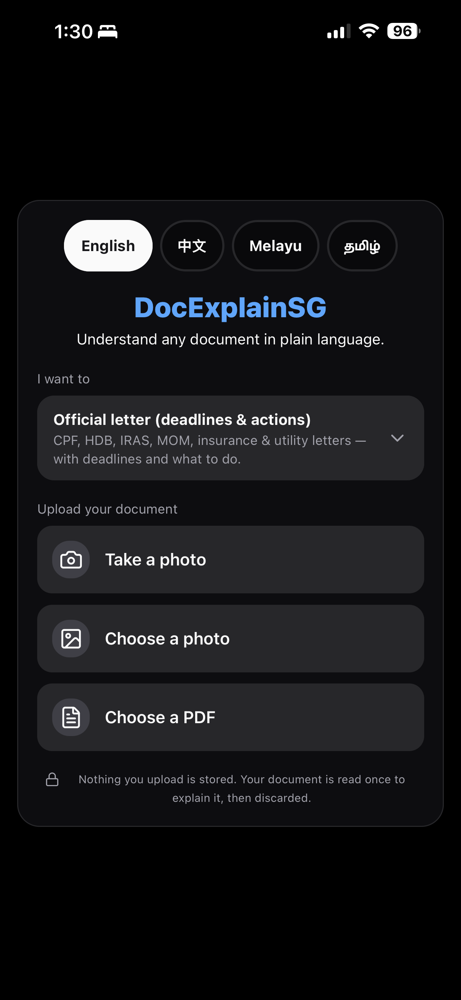
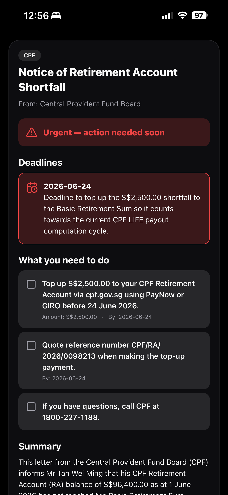

# DocExplainSG

**Snap or upload an official Singapore document and get a plain-language explanation — in English, Mandarin (中文), Malay (Bahasa Melayu), or Tamil (தமிழ்) — with deadlines and required actions surfaced up front.**

| Home | Explanation |
| :--: | :--: |
|  |  |

🎬 **Demo:** [`media/demo.MP4`](media/demo.MP4) — short screen recording of the full flow (download/open to play; `.MP4` doesn't inline-render on GitHub).

> **Status: working MVP / prototype**, built solo, phase by phase. It runs end to end against synthetic sample documents. Handling people's *real* CPF/HDB/IRAS documents in production would require a formal PDPA review and the privacy hardening listed at the bottom — this repo is honest about that gap rather than hiding it.

---

## What it does

Singapore government and financial letters — CPF notices, HDB letters, IRAS assessments, MOM/work-pass letters, insurance policies, town-council and utility notices — are dense, jargon-heavy, and often not in the reader's first language. Missing a buried deadline has real consequences.

DocExplainSG reads the document (typed PDF, scanned PDF, or a phone photo), then returns a clear explanation in the reader's chosen language with **deadlines and required actions pulled to the top**. You can ask follow-up questions about the document and save the explanation as a PDF.

---

## Features

- **Three analysis modes**, each a dedicated endpoint:
  - **Explain an official letter** → structured breakdown (document type, issuer, urgency, deadlines, required actions, summary, key points, reference numbers, glossary).
  - **Summarize any document** → plain-language summary for non-SG-form documents (contracts, reports, notices).
  - **Ask a follow-up** → grounded Q&A that answers **only** from the document and refuses to fabricate when the answer isn't there.
- **Multilingual output** in English / 中文 / Bahasa Melayu / தமிழ் — the language choice drives both the UI and the AI output, and persists across launches.
- **Vision + text** — handles JPG/PNG/WEBP/HEIC photos and PDFs (both text-based and scanned).
- **Share/save** the explanation as a PDF.
- **Accessibility** — screen-reader grouping and labels, font-scale-safe layout, and localized empty/error states with retry.
- **Privacy by design** — stateless backend, NRIC/FIN redaction, and an AI provider that doesn't train on submitted data (details below).

---

## Tech stack

**Frontend** (`app/`)
- Expo SDK 54, React Native 0.81, TypeScript, expo-router, React Query
- i18next for UI localization (en/zh/ms/ta)
- NativeWind v4 (Tailwind) with hand-authored, shadcn-style UI components (react-native-reusables pattern: `cva` variants + a `cn()` helper)
- lucide-react-native icons; Inter font with a **language-aware font fallback** (system font for zh/ta to avoid tofu/missing glyphs)
- Dark-mode-first zinc theme; iOS-primary but cross-platform, with web for quick previews

**Backend** (`api/`)
- FastAPI on Python 3.12, dependency/venv management with **uv** (not pip)
- Stateless request handling

**AI**
- Anthropic Claude via the official SDK
- **Structured output** (`messages.parse` with Pydantic schemas) so every response is typed JSON, not free text
- **Vision** via base64 image blocks for photos and scanned PDFs
- Default model `claude-sonnet-4-6`, swappable to `claude-haiku-4-5` (cheaper/faster) or `claude-opus-4-8`

**Deployment**
- Render blueprint ([`render.yaml`](render.yaml)), Singapore region for data residency

---

## Architecture

```
[Expo app]
   │  multipart upload (1+ files) + target language
   ▼
[FastAPI]
   │  PDF → extract text     │
   │  image / scanned PDF → vision (base64)
   ▼
[Single structured Claude call]  (Pydantic schema → typed JSON)
   │  summary · deadlines · actions · urgency · refs · glossary
   ▼
[Expo app]  renders the result in the chosen language
```

The backend is **stateless**: documents are processed in memory and discarded when the response is sent. There is no document database.

---

## Quick start

### Backend (`api/`)

```bash
cd api
uv sync                                   # creates the venv + installs deps (Python 3.12 auto-provisioned)
cp .env.example .env                      # then set ANTHROPIC_API_KEY
uv run uvicorn app.main:app --host 0.0.0.0 --port 8000
```

- Health check: <http://localhost:8000/api/health>
- Interactive API docs: <http://localhost:8000/docs>
- Tests: `uv run pytest`

Try it against a bundled synthetic sample:

```bash
curl -X POST http://localhost:8000/api/analyze \
  -F "language=en" \
  -F "files=@samples/cpf_retirement_topup.pdf;type=application/pdf"
```

### Frontend (`app/`)

```bash
cd app
npm install            # .npmrc sets legacy-peer-deps; no flags needed
npx expo start         # press i for iOS simulator, or scan the QR in Expo Go
# or:
npx expo start --web   # browser preview, no device needed
```

Built on **Expo SDK 54**, which the current App Store / Play Store **Expo Go** client supports — so you can scan the QR and run it on a real phone without a custom build. For a deployed backend, set `EXPO_PUBLIC_API_BASE` (e.g. in `app/.env`); on the same Wi-Fi the app otherwise auto-detects the dev host on port 8000 (bind the backend to `0.0.0.0`).

---

## Configuration

All backend config is environment-driven (see [`api/.env.example`](api/.env.example)):

| Variable | Default | Purpose |
| --- | --- | --- |
| `ANTHROPIC_API_KEY` | _(none)_ | Anthropic Claude key. Required for analysis. |
| `ANTHROPIC_MODEL` | `claude-sonnet-4-6` | Swappable (`claude-haiku-4-5`, `claude-opus-4-8`). |
| `LLM_TIMEOUT_S` | `45` | Per-request LLM timeout (seconds) so a stalled call fails fast. |
| `MAX_UPLOAD_MB` | `20` | Cap on total upload size per request. |
| `MAX_FILES` | `10` | Cap on files (pages/photos) per request. |
| `CORS_ORIGINS` | `*` | Comma-separated allowed origins. Lock down for production. |

The API key is **never hardcoded and never returned by any endpoint** — `/api/health` only reports whether one is configured.

### Endpoints

| Method | Path | Purpose |
| --- | --- | --- |
| `GET` | `/api/health` | Liveness; reports whether a key is configured. |
| `POST` | `/api/analyze` | Structured analysis of an SG official letter. `multipart/form-data`: `files` + `language`. Returns `AnalysisResult`. |
| `POST` | `/api/summarize` | Plain-language summary of **any** document. Same form. Returns `GenericSummary`. |
| `POST` | `/api/ask` | Grounded follow-up Q&A. JSON `{ document_context, question, language }`. Answers only from the context. |

Errors are friendly and never leak internals (`400` bad language, `413` too large, `415` unreadable/wrong type, `502` model failure after one retry).

---

## Privacy & PDPA

This app handles sensitive government and financial documents, so privacy is a first-class design constraint, not an afterthought:

- **Stateless, no persistence.** Documents and extracted text live only in memory for the duration of a request and are discarded on response. There is no document database.
- **No content logging.** Only non-sensitive metadata (timestamps, latency, error codes) is logged — never document contents or extracted personal data.
- **NRIC/FIN redaction, defense-in-depth.** The prompt instructs the model never to emit an NRIC/FIN, and a regex scrub strips them from the output as a backstop if the model ever does.
- **An AI provider that doesn't train on your data.** DocExplainSG uses Anthropic's **commercial API**, which does **not** train on submitted prompts or responses (zero-retention options exist for stricter requirements) — the privacy-appropriate stance for sensitive documents.

A first-run privacy notice and in-app disclaimers ship in the app. See **[PDPA_CHECKLIST.md](PDPA_CHECKLIST.md)** for the obligation-by-obligation checklist and pre-launch gate, and **[PRIVACY.md](PRIVACY.md)** for a draft privacy policy (pending legal review).

---

## Engineering decisions & trade-offs

- **Claude with structured output + vision.** `messages.parse` with Pydantic schemas means responses are *typed JSON*, not text I have to parse defensively — extraction (deadlines, amounts, refs) maps straight onto a model. Vision handles photos and scanned PDFs in the same call. The commercial API's no-training guarantee was the deciding factor for sensitive-document handling. *(This project migrated off Google Gemini for exactly that privacy reason.)*
- **Stateless backend.** The simplest design that's also the most defensible privacy posture — nothing to leak because nothing is stored.
- **Expo SDK 54 (not the newest).** Pinned to the SDK the public Expo Go client supports, so the app runs on a real phone by scanning a QR — no custom dev build needed to demo it.
- **uv for Python.** Fast, reproducible installs and automatic Python 3.12 provisioning; one tool for venv + deps.
- **NativeWind + hand-authored components.** shadcn-style components (cva variants + `cn()`) give a consistent design system without pulling in a web-only UI kit that doesn't run on React Native.
- **Language-aware font fallback.** Inter for Latin scripts, system fonts for Chinese/Tamil — avoids tofu boxes for glyphs Inter doesn't ship.
- **Single structured LLM call per analysis.** Keeps latency and cost predictable; one retry on transient model errors, then a friendly failure.

---

## Sample documents

[`samples/`](samples/) holds synthetic, **entirely fictional** SG letters (CPF, HDB, IRAS, MOM, insurance) — fake names, NRICs, amounts, and references — for testing without touching real personal data. Regenerate with:

```bash
cd api && uv run python ../samples/generate_samples.py
```

---

## Known limitations & what I'd do next

**Current limitations**
- MVP demoed against the synthetic `samples/`; not yet pointed at real-world consented documents.
- Latency is typically a few seconds per analysis; reasoning depth is left at the model default.
- Camera uses the system picker (not a custom `expo-camera` UI). The "Your document" view shows uploaded thumbnails; a true extracted-text toggle would require returning the text from the API.
- No user accounts, history, payments, or offline AI (all explicitly out of MVP scope).

**For production**
1. **Privacy gate:** complete a formal PDPA review (DPO, DPA/zero-retention agreement, DPIA, consent flow) before accepting any real user document.
2. **Hardening:** rate limiting, request size/timeout tuning, structured metadata logging + monitoring, containerized deploy behind HTTPS, secrets in a vault.
3. **Quality:** an evaluation set across document types with automated checks that **deadlines and amounts are never invented**; prompt tuning per latency/quality targets; response streaming for perceived speed.
4. **Distribution:** EAS development/production builds for iOS & Android (custom camera, HEIC handling, store release).
5. **Accessibility:** device testing with VoiceOver/TalkBack at 200% font scale.

---

## Monorepo layout

```
DocExplainSG/
├── app/        # Expo (React Native) frontend — TypeScript, expo-router
├── api/        # FastAPI backend — Python 3.12, uv-managed
├── samples/    # Synthetic test documents
├── media/      # Screenshots + demo video
├── PDPA_CHECKLIST.md
├── PRIVACY.md
└── render.yaml # Render deployment blueprint
```
